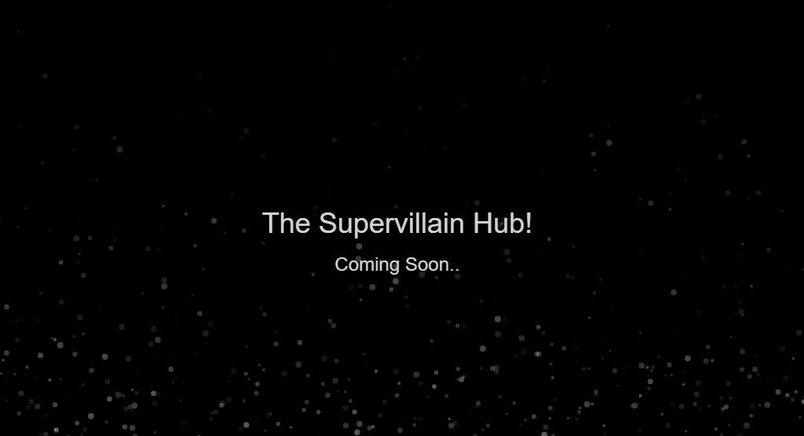

# Supervillain Hub

#### The only account a Supervillain Needs!

I wanted something fun to build in my downtime. I got the idea from watching Minions to make a hub for all us Supervillains! 

_How very evilllll..._

## 

## FAQ

#### As a supervillain, why should I join?

This is an oportunity to flaut your evil doing and show off your evil acts of evilness to peers around the globe.

#### How Do I join?

You must be invited by a fellow supervillain, or use the sign up form.

#### What benifits are there?

As part of the guild you will get access to our evil newsletter. And access to our evil media empire and World Domaination Platform as a Service 'WD-PaaS'.

#### What is a 'Pro Tier' supervillain and how do I become one?

To become a pro tier supervillain you must help out with building the platform, all coders and all levels of coders are welcome.

#### Should I use my real name or details on the platform?

No of course not, feel free to use your GitHub name as your supervilain alias.

## URL 

[Supervillain Hub](https://supervillain.cloud/)

## Contents

Website is React.js/HTML \
Server is Express.js \
Container is Node.js \
Deployment is via Helm Chart \
Infra is a Linode Kubernetes clsuter 

## Builds

Builds use GitHub workflows.

## Dev Goals

Build a frontend in react/nextjs/html \
Build a backend in javascript and run it in node.js z
Store users info in MongoDB \
Use KeyCloak for user management/signup \
Store images and uploads in S3 \
Let the feature creep roll.. 

## Continuous Deployment

I'll try get FluxCD working for it at some point to save me restarting the pod each time a new image builds.

## Contribution/License

Feel free to fork, clone, or downright steal the code, we are supervillains after all. Under [MIT License](./LICENSE). 

I make mistakes, so if you spot anything that I should fix for any reason like security or whatnot, point it out, I'll be grateful of the chance to improve!

